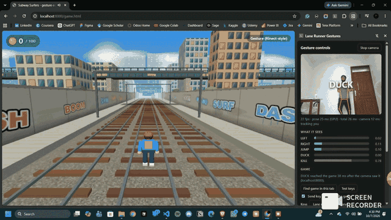
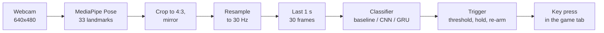

# Subway Surfer IRL

Play three-lane runner games with your whole body. Step left or right to change lanes, jump to jump and duck to roll, in front of an ordinary webcam. A Chrome extension watches you, recognises the gesture in about a tenth of a second and presses the matching key in whatever game is open in the tab.



*The browser game on the left and the extension's side panel on the right. The side panel shows the camera view, the recognised gesture and the model's confidence for each class. Full-quality recording: [docs/gameplay.mp4](docs/gameplay.mp4).*

## Contents

1. [What's in the repository](#whats-in-the-repository)
2. [How it works](#how-it-works)
3. [Quick start](#quick-start)
4. [Using the extension](#using-the-extension)
   - [Install](#install)
   - [Step by step](#step-by-step)
   - [What each part of the panel does](#what-each-part-of-the-panel-does)
   - [Keys](#keys-which-preset-for-which-game), [Models](#models), [Responsiveness](#responsiveness), [Pose engine](#pose-engine-gpu-or-cpu)
5. [Repository layout](#repository-layout)
6. [How it was built](#how-it-was-built)
   - [Collecting the data](#1-collecting-the-data)
   - [Labelling the gestures](#2-labelling-the-gestures)
   - [The shared pipeline](#3-the-shared-pipeline)
   - [Training the models](#4-training-the-models)
   - [The Chrome extension](#5-the-chrome-extension)
   - [The game](#6-the-game)
6. [Retraining with new data](#retraining-with-new-data)
7. [Tests](#tests)
8. [Performance and troubleshooting](#performance-and-troubleshooting)
9. [Tech stack](#tech-stack)
10. [Credits and licences](#credits-and-licences)

## What's in the repository

The project has three parts that share one gesture pipeline:

| Part | Folder | What it is |
|---|---|---|
| Gesture pipeline | [`gestures/`](gestures) | Python tools to record training sessions, label them, train and evaluate the classifiers, and build the extension |
| Chrome extension | [`extension/`](extension) | "Lane Runner Gestures": runs the camera, pose model and classifier in a side panel and sends key presses to the game in the active tab |
| Browser game | [`game/`](game) | A Subway Surfers clone rebuilt with three.js and tuned for body control: more time between hazards, longer jumps, forgiving timing |

The extension works with any three-lane runner that takes arrow keys, for example Subway Surfers on Poki. It also has presets for dinosaur-style jump games.

## How it works



1. **Pose.** MediaPipe's Pose Landmarker (lite) finds 33 body landmarks in every camera frame.
2. **Normalising.** Frames are cropped to 4:3 and mirrored, the same way the training recordings were. Landmarks are then resampled onto a fixed 30 Hz grid, so the classifier sees the same timing whatever the camera's frame rate.
3. **Classifying.** Each new frame completes a 1-second window (30 frames). The classifier turns that window into five probabilities: `LEFT`, `RIGHT`, `JUMP`, `DUCK` and `IDLE`.
4. **Triggering.** A gesture fires when its probability stays above a threshold for a few frames. The trigger then waits until the model is back at idle before it can fire again, so one movement gives exactly one key press.
5. **Key press.** The extension dispatches the key (arrow keys by default) on the game's canvas inside the page.

The same pipeline exists twice: in Python for training and evaluation, and in JavaScript inside the extension. Golden test files make sure both produce the same numbers.

## Quick start

### Play the game with the keyboard

```powershell
python game/serve.py
```

Open <http://localhost:8000>, pick a difficulty and press **Play**. Use the arrow keys (or A / D) to change lanes, and Space, ↑ or W to jump.

### Play with your body

Load the [`extension/`](extension) folder in Chrome, open a game, press **Start camera** in the side panel and move. The [step-by-step guide](#using-the-extension) explains every button and setting.

### Set up the Python tools

The recording, labelling and training tools need Python 3.12.

```powershell
python -m venv myenv
.\myenv\Scripts\activate
pip install -r requirements.txt
```

`torch` is only needed to train the CNN and GRU (`gestures/deep.py`). To install the smaller CPU-only build, use `pip install torch --index-url https://download.pytorch.org/whl/cpu`. Run every command from the repository root, for example `python gestures/baseline.py`.

## Using the extension

### Install

1. Open `chrome://extensions` in Chrome 116 or newer and turn on **Developer mode** (top right).
2. Click **Load unpacked** and pick the [`extension/`](extension) folder.
3. Optional: pin **Lane Runner Gestures** from the puzzle-piece menu so its icon stays in the toolbar.
4. Reload any game tab that was already open. The extension can only reach pages loaded after it was installed.

### Step by step

1. **Open a game in a tab.**
   - **This repo's game:** run `python game/serve.py` and open <http://localhost:8000>. Set **Graphics** to **Low**, which leaves GPU time for the pose model.
   - **Other games:** any lane runner works, for example Subway Surfers on Poki, or a dinosaur jump game.
2. **Open the side panel.** Click the extension's icon. The side panel opens on the right of the window.
3. **Pick the key preset** that matches the game, under **Game → Keys** (see [Keys](#keys-which-preset-for-which-game)).
4. **Press Start camera.**
   - The first time, Chrome asks for camera access.
   - If that prompt is blocked, a **Grant camera access** button appears. Click it, allow the camera on the page that opens, close that page and press **Start camera** again.
5. **Stand in view while it measures.**
   - With **Pose engine** on **Auto**, the status line shows `Measuring GPU speed - stand in view…` and then the same for the CPU.
   - It then says which engine it chose, for example `Using GPU (measured GPU 21 ms, CPU … ms)`.
6. **Frame yourself.** Step back until your head, shoulders and hips appear in the preview, ideally your knees too. The drawn skeleton shows what the pose model tracks, and the status line should end with `tracking you`.
7. **Give the game focus.** Click once inside the game so it receives keyboard input. Then step back to your starting spot, which is the middle lane.
8. **Play.**
   - Start the game and move.
   - Each recognised gesture flashes over the preview.
   - The **Game** line reports how fast it got there, for example `RIGHT reached the game 29 ms after the camera saw it (localhost:8000)`.
9. **Stop.** Press **Stop camera** when you are done. This turns the webcam off.

### What each part of the panel does

| Control or readout | What it does |
|---|---|
| **Start camera / Stop camera** | Turns the webcam and gesture detection on or off. Starting also measures the pose engines (in Auto), resets the pipeline and looks for the game in the current tab. |
| **Preview** | Your mirrored camera view with the tracked skeleton. Recognised gestures flash on top of it. |
| **Status line** | `fps` (frames processed per second), `pose` (milliseconds per frame for the pose model and which engine runs it), `total` (all processing per frame), `camera` (delay from capture to processing), and `tracking you` or `no one in view`. It turns red below 20 fps. Below 11 fps it says **Too slow for gestures** and suggests a fix. |
| **What it sees** | Live bars with the model's probability (0–1) for `LEFT`, `RIGHT`, `JUMP`, `DUCK` and `IDLE`. Standing still keeps `IDLE` near 1. A movement pushes its bar up. A key is sent only when the bar stays high long enough for the chosen [responsiveness](#responsiveness). |
| **Game line** | Which page and canvas receive the keys, and the delay for each gesture that was sent |
| **Find game in this tab** | Searches every frame of the active tab, including iframes on game portals, for the largest canvas and sends keys there. It runs automatically on Start and when you switch tabs. Press it if you opened or reloaded the game after starting the camera. |
| **Test keys** | Checks the connection without the camera. After a 3-second countdown (click into the game during it), it sends each gesture's key once, 1.2 s apart. If the game reacts, the keys get through. |
| **Send key presses to the game** | Untick it to keep recognising gestures (bars and flashes still work) without sending anything. Useful for practising or checking the model without affecting the game. |
| **Keys** | Which key each gesture presses, see below |
| **Model** | Which classifier turns your movement into gestures, see below |
| **Responsiveness** | How quickly a gesture fires versus how many false moves you accept, see below |
| **Model info line** | The measured latency, catch rate and false moves per minute for the chosen model and responsiveness |
| **Pose engine** | Where the pose model runs: Auto, GPU or CPU, see below |

All settings are remembered between sessions.

### Keys: which preset for which game

| Preset | LEFT | RIGHT | JUMP | DUCK | Use it for |
|---|---|---|---|---|---|
| **Lane runner: arrow keys** | ← | → | ↑ | ↓ | Subway Surfers on Poki, this repo's game, most lane runners |
| **Lane runner: W A S D** | A | D | W | S | Lane runners that use W A S D |
| **Dino: ↑ jump, ↓ duck (held)** | nothing | nothing | ↑ held 300 ms | ↓ held 600 ms | Chrome-dino style games that jump with the up arrow |
| **Dino: Space jump, ↓ duck (held)** | nothing | nothing | Space held 300 ms | ↓ held 600 ms | Dino games that jump with Space |

Lane runner presets tap each key (100 ms). Dino games work differently, so their presets hold the key down:

- **Jump height:** the longer the jump key is down, the higher the dino jumps.
- **Ducking:** the dino only ducks while ↓ is held.
- **Sidesteps:** they do nothing, because a dino game has no lanes.

In this repo's game, ducking has no effect because there is nothing to roll under.

### Models

All three models read the same thing: your last second of movement (30 frames of body landmarks). They differ in how they decide.

| Model | What it is | Per-frame cost | When to use it |
|---|---|---|---|
| **Baseline (motion features)** | Hand-designed: 56 numbers summarise the last second, such as how far and how fast the body centre, arms and head moved and how much the knees bent. A simple weighted formula (softmax regression) turns those numbers into probabilities. | ~0.1 ms | The default. Most accurate on the recorded data, fastest, and easy to reason about. |
| **CNN** | A small convolutional neural network (13.8k weights). It looks at the raw positions and speeds of 13 joints across the 30 frames and learns its own movement patterns. | ~2.7 ms | To compare a learned model with the hand-designed one |
| **GRU** | A small recurrent neural network (8.4k weights). It reads the 30 frames in order while keeping a running memory of the movement. | ~1 ms | To compare. Its balanced setting fires slightly sooner than the others. |

The per-frame costs are classifier time only, measured in the golden test, and tiny next to the pose model. The neural models were trained on one session per fold, so they are expected to catch up as more sessions are recorded. Switching models takes effect immediately; the new model needs one second of movement to fill its window.

### Responsiveness

| Setting | What changes | Typical latency (baseline) | Trade-off |
|---|---|---|---|
| **Balanced** | Waits for 2–3 confident frames in a row | ~0.13 s | Fewest false moves |
| **Fast** | Fires after fewer confident frames, or at a lower threshold | ~0.10 s | A few more false moves |
| **Fastest** | Lowest threshold and shortest wait | ~0.07 s | Most false moves, still under 1 per minute in testing |

The exact numbers for every model are in the [presets table](#4-training-the-models). Whatever the setting, each movement fires once: the trigger waits until you are back at rest before it can fire again.

### Pose engine: GPU or CPU

| Option | What it does | Best when |
|---|---|---|
| **Auto** | Times both engines for 25 frames when you press Start, keeps the faster one and shows both timings | Almost always. Start the camera with the game open, so the measurement includes the game's load. |
| **GPU** | Runs the pose model on the graphics card through WebGL | Your GPU has spare capacity. It is usually the fastest, but it shares the card with the game's graphics. |
| **CPU** | Runs the pose model on the processor through WebAssembly | The GPU is busy with the game or is a weak integrated chip. It doesn't compete with the game's graphics. |

A change of engine applies the next time you press **Start camera**, so press **Stop camera** and then **Start camera**. On laptops with two GPUs, Chrome may be using the weaker one; see [troubleshooting](#performance-and-troubleshooting).

### Tips for reliable detection

- **Light:** use good lighting. A dark room makes the camera expose longer and lowers the frame rate.
- **Clear movements:** make full ones, such as a real step into the next lane, a real jump or a real crouch, then return to rest.
- **Pause between moves:** the models judge how you moved during the last second, not where you stand, so a brief pause at rest makes the next gesture clearer.
- **Other people and rooms:** the models were trained on recordings of one person in one room. Someone else or a different room may need a few new recordings, see [Retraining with new data](#retraining-with-new-data).

## Repository layout

```
Subway-Surfer-IRL/
├── gestures/              Python: recording, labelling, models, tests, build
├── data/
│   ├── raw/               recorded sessions (landmarks + cue logs)
│   └── labels/            labelled 1-second windows per session
├── models/                trained classifiers (JSON) and the MediaPipe pose model
├── tests/                 golden files shared by the Python and JavaScript tests
├── extension/             Chrome extension (Manifest V3)
├── game/                  browser game (three.js)
├── docs/                  gameplay GIF and video
└── requirements.txt
```

### `gestures/`: the Python pipeline

| File | Purpose |
|---|---|
| [`pose.py`](gestures/pose.py) | Shared MediaPipe setup: downloads the pose model, creates the landmarker, names the landmarks and draws the skeleton. Run on its own, it is a live debug viewer. |
| [`record_session.py`](gestures/record_session.py) | Cued recorder: shows gesture prompts with countdowns and beeps, records every frame's landmarks and writes a session to `data/raw/` |
| [`label_windows.py`](gestures/label_windows.py) | Finds when each cued movement really started and cuts labelled 1-second windows into `data/labels/` |
| [`pipeline.py`](gestures/pipeline.py) | The pipeline contract: 30 Hz resampler, window normalisation, mirror augmentation, classifier base class, trigger, model file format |
| [`baseline.py`](gestures/baseline.py) | Baseline classifier: 56 hand-designed motion features and a softmax regression written in NumPy |
| [`deep.py`](gestures/deep.py) | CNN and GRU classifiers: trained with PyTorch, run with a NumPy forward pass so the browser port needs no ML library |
| [`playback.py`](gestures/playback.py) | Replays whole recorded sessions through a model and trigger, and scores latency, detection rate and false triggers per minute |
| [`test_pipeline.py`](gestures/test_pipeline.py) | Checks that frame-by-frame and batch processing agree, and checks or rewrites the golden files in `tests/` |
| [`build_extension.py`](gestures/build_extension.py) | Copies the models into `extension/`, downloads MediaPipe's browser build and runs the JavaScript golden test |

### `data/`, `models/`, `tests/`

| Path | Contents |
|---|---|
| `data/raw/<session>.npz` | `landmarks` (frames × 33 × 4: x, y, z, visibility; NaN when no person was found), `timestamps`, `frame_ok` |
| `data/raw/<session>_meta.json` | Camera, frame rate, timing per stage, random seed, framing check and the full cue log (every rest, countdown and cue with timestamps and lanes) |
| `data/labels/<session>.json` | Labelling parameters, a summary, every rep (kept or dropped, with the reason) and every window (start time, label, source) |
| `models/baseline.json`, `cnn.json`, `gru.json` | Trained weights, input settings, default trigger and the three measured responsiveness presets |
| `models/pose_landmarker_lite.task` | MediaPipe Pose Landmarker (lite) |
| `tests/golden_<model>.json` | A stretch of a real session with the expected probabilities and events, for each model |

### `extension/`: Lane Runner Gestures

| File | Purpose |
|---|---|
| `manifest.json` | Manifest V3: side panel, storage and webNavigation permissions, content scripts, a CSP that allows WebAssembly |
| `sidepanel.html` / `.css` / `.js` | The control panel: camera, pose detection, classifier, trigger, settings and status |
| `pipeline.js` | JavaScript port of `pipeline.py`, `baseline.py` and the neural forward passes |
| `content.js` | Runs in every frame of every page, finds the largest canvas and passes key requests to it |
| `inject.js` | Runs in the page's own JavaScript world and builds the keyboard events, so games that read `keyCode` see real values |
| `background.js` | Opens the side panel from the toolbar icon |
| `permission.html` / `.js` | One-off page that asks for camera permission |
| `models/`, `vendor/mediapipe/` | Model files and MediaPipe tasks-vision 1.0.1, generated by `build_extension.py` and committed so the folder loads straight away |
| `test/golden.test.js` | Runs the JavaScript pipeline against `tests/golden_*.json` (`npm test` in this folder) |

### `game/`: the browser game

| File | Purpose |
|---|---|
| `game.html`, `index.html`, `style.css` | Page, menu and HUD. `index.html` forwards to `game.html`. |
| `serve.py` | Local server that tells the browser to check for changed files on every load |
| `src/config.js` | The difficulty presets |
| `src/rules.js`, `src/spawner.js` | Fixed 60 Hz simulation, stumbles and chase, rows of hazards and coins |
| `src/player.js`, `obstacle.js`, `barrier.js`, `coin.js`, `boost.js`, `police.js`, `finishline.js` | Game objects and their per-tick rules |
| `src/scene.js` | The three.js renderer. It only reads game state. |
| `src/main.js`, `keyhandler.js`, `autopilot.js`, `utility.js` | Frame loop, keyboard input, the `?autopilot=1` bot, helpers |
| `tools/simulate.js` | Plays the real rules headlessly with a bot whose key presses arrive late, like gestures |
| `libs/` | three.js r159 and jQuery 3.3.1 |
| `assets/bgmusic.mp3` | Background music |

## How it was built

### 1. Collecting the data

[`record_session.py`](gestures/record_session.py) records the training data:

```powershell
python gestures/record_session.py --session s03
python gestures/record_session.py --session test --dry-run
```

The `--dry-run` session is a short 2-rep check, saved with a `dry_` prefix.

**Session structure.** A session has 20 reps of each gesture plus 15 distractors (95 cues). Each cue is a rest of 2–3.5 s, a 1 s countdown, then the prompt with a beep and 3 s to move. A 3 s tail closes the session.

**Distractors.** These are everyday movements the game must ignore, such as "scratch your head", "stretch your arms up" or "look over your shoulder". They become hard `IDLE` examples.

**Cue order.** Cues are shuffled, with a few rules:

- **Repetition:** no gesture three times in a row, and at most four sidesteps in a row.
- **Lanes:** sidesteps are planned as a walk across three lanes, so the player never steps out of the lane area. A lane indicator shows where to stand.
- **Seed:** `--seed` makes the order reproducible.

**Framing check.** Recording only starts when the shoulders and hips are clearly visible and the hips sit high enough in the frame to leave room for ducking. The camera must also deliver at least 20 fps. If it fails, the recorder says why: step back, more light, and so on.

**Timing.** The capture loop never sleeps. Each frame's capture time is logged, frames with no detected person are stored as NaN rows so the timeline stays intact, and the camera is opened through DirectShow, which ran at about 30 fps where Media Foundation managed 21.

Two full sessions were recorded, `s01` and `s02`, plus one dry run.

### 2. Labelling the gestures

People don't move exactly when the cue appears. In the recordings the reaction came 0.9–1.1 s after the prompt. [`label_windows.py`](gestures/label_windows.py) therefore finds the real start of each movement:

```powershell
python gestures/label_windows.py
```

1. **Baseline.** It takes the body centre's position from 1.5 s to 1.0 s before the cue.
2. **Onset.** It tracks how far the body centre moves from there, in torso lengths. The onset is the first frame where that distance passes 0.10, walked back to where it started rising.
3. **Dropped reps.** A rep is dropped if it has a tracking gap over 150 ms, the person moved during the countdown, nothing moved, or the movement went less than 0.2 torso lengths in the expected direction.
4. **Gesture windows.** Each kept rep yields seven 1-second windows ending 0.15–0.5 s after the onset. The model learns to recognise a movement early, while it is still happening.
5. **`IDLE` windows.** These come from three sources: quiet rest periods, distractor movements, and the recovery after each gesture (stepping back, landing). The recovery windows stop one movement from firing twice.

| Session | LEFT | RIGHT | JUMP | DUCK | IDLE (rest / distractor / recovery) | Total |
|---|---|---|---|---|---|---|
| s01 | 140 | 133 | 140 | 133 | 691 (301 / 105 / 285) | 1,237 |
| s02 | 140 | 140 | 140 | 140 | 717 (322 / 105 / 290) | 1,277 |

Two reps out of 160 were dropped, both in `s01`. The label files store window start times, not copies of the landmarks: the windows are rebuilt from `data/raw/` whenever they are needed.

### 3. The shared pipeline

[`pipeline.py`](gestures/pipeline.py) defines the contract that every model and both languages follow:

- **Resampler.** Linear interpolation onto a 30 Hz grid. A gap longer than 0.10 s between detections marks the frames inside it invalid, and an invalid frame empties the window. The model never sees landmarks invented across a real tracking loss.
- **Normalisation.** x and y become relative to the body centre at the start of the window, divided by the median torso length. A window means the same whether you stand close to the camera or far away.
- **Mirroring.** Flips x, swaps left and right joints, and swaps the `LEFT` and `RIGHT` labels. This doubles the training data and balances both directions.
- **Trigger.** A gesture fires when its probability stays above `thresh` for `hold` frames. It re-arms only after every gesture probability drops below 0.4, with a 0.5 s cooldown.
- **Model files.** Plain JSON: weights, inputs, default trigger and presets. The browser loads them directly.

[`extension/pipeline.js`](extension/pipeline.js) is a line-for-line JavaScript port. [`test_pipeline.py`](gestures/test_pipeline.py) exports a stretch of a real session containing every gesture to `tests/golden_<model>.json`. [`golden.test.js`](extension/test/golden.test.js) checks that the JavaScript port reproduces the same probabilities (within 1e-4) and the same events.

### 4. Training the models

```powershell
python gestures/baseline.py
python gestures/deep.py cnn
python gestures/deep.py gru
```

Each script evaluates with **leave-one-session-out** (train on `s01` and test on `s02`, then the reverse), then trains on all sessions and saves to `models/`. Evaluation reports two things:

- **Window accuracy:** with a confusion matrix split by window source.
- **Full-session playback:** every recorded session is replayed frame by frame through the model and trigger, exactly as it would run live, and scored on latency, detection rate and false triggers per minute.

**Baseline** (default):

- **Signals:** seven, computed from the landmarks:
  - body x and body y
  - arms x and arms y, relative to the body
  - head height
  - knee bend
  - torso length
- **Features:** eight statistics per signal, 56 in total:
  - end value, minimum and maximum
  - minimum and maximum velocity
  - "recent" change, minimum velocity and maximum velocity over the last 0.3 s
- **Classifier:** softmax regression in NumPy, with class weights, L2 regularisation (1e-3) and 3,000 gradient steps on standardised features.

**CNN** (13.8k parameters):

- **Input:** 13 joints (nose, shoulders, elbows, wrists, hips, knees, ankles). Their positions plus frame-to-frame velocities give 52 values per frame.
- **Layers:** two 1D convolutions (kernel 5, 32 channels, ReLU). The output combines a max over time with the mean of the last 9 frames, followed by a linear layer.

**GRU** (8.4k parameters):

- **Input:** the same as the CNN.
- **Layers:** one GRU layer with 32 hidden units and a linear layer on the final state.

**Neural training:**

- **Optimiser:** Adam (learning rate 1e-3, weight decay 1e-4), 40 epochs, batch 64, class-weighted cross-entropy, mirror augmentation.
- **Export:** weights are saved as JSON and checked against a NumPy forward pass, which is what both Python and the extension run.

**Responsiveness presets.** These were measured on held-out sessions. Latency is how long after the movement starts the gesture fires.

| Model | Preset | Trigger (thresh / hold) | Latency | Gestures caught | False triggers |
|---|---|---|---|---|---|
| Baseline | Balanced | 0.9 / 2 | 0.133 s | 99.4% | 0.42 / min |
| Baseline | Fast | 0.9 / 1 | 0.100 s | 98.1% | 0.61 / min |
| Baseline | Fastest | 0.8 / 1 | 0.067 s | 96.8% | 0.89 / min |
| CNN | Balanced | 0.9 / 3 | 0.133 s | 97.7% | 0.59 / min |
| CNN | Fast | 0.8 / 3 | 0.100 s | 97.0% | 0.76 / min |
| CNN | Fastest | 0.8 / 2 | 0.067 s | 96.4% | 0.94 / min |
| GRU | Balanced | 0.9 / 3 | 0.111 s | 96.8% | 0.56 / min |
| GRU | Fast | 0.8 / 3 | 0.100 s | 96.4% | 0.80 / min |
| GRU | Fastest | 0.8 / 2 | 0.067 s | 96.4% | 0.90 / min |

At the same latency the baseline catches more gestures with fewer false triggers, so it is the default. The neural models were trained on only one session per fold. With more sessions recorded they are the ones expected to improve, and the extension keeps them selectable for comparison.

**Making it faster.** The first models labelled windows late in the movement and waited about 0.33 s after you started moving. Two changes brought that down to about 0.13 s:

- **Earlier window ends:** 0.15–0.5 s after the onset.
- **"Recent" features:** they tell the model what the last 0.3 s looked like.

### 5. The Chrome extension

The extension does everything locally in the browser. No video leaves the machine.

- **Pose in the browser:**
  - **Runtime:** MediaPipe tasks-vision 1.0.1 runs as WebAssembly, on the GPU or the CPU. It ships inside the extension because Manifest V3 forbids loading code from the web.
  - **Settings:** the same as the Python version, so the live landmarks match the training data.
- **Matching the training frames:** the recorder cropped and mirrored the image before pose detection. The side panel gets the same result more cheaply by applying the crop, the mirror and a left/right swap to the 33 landmarks.
- **Engine choice:**
  - **Auto:** on Start it times both the GPU and CPU engines for 25 frames and keeps the faster one.
  - **Why measure:** the GPU is shared with the game, so the faster one depends on the machine.
- **Finding the game:** Chrome's webNavigation API lists the tab's frames, and each frame is asked whether it holds a large canvas. This matters for portals like Poki, where the game sits inside an iframe.
- **Pressing keys:**
  - **Problem:** content scripts run in an isolated JavaScript world, where a `keyCode` patched onto an event is invisible to the page.
  - **Fix:** `content.js` passes the request to `inject.js`, which builds the `KeyboardEvent` in the page's own world.
  - **Hold time:** keys are held for 100 ms. Dino presets hold jump for 300 ms and duck for 600 ms, because those games jump higher the longer the key is down.
- **Model switching:** changing the model or responsiveness takes effect immediately. A new classifier needs one second of frames to fill its window.

### 6. The game

The game started from [RohanChacko/Subway-Surfers](https://github.com/RohanChacko/Subway-Surfers) (MIT licence). Its game rules were reworked for body control, and the graphics were rebuilt from scratch in three.js.

**Gameplay changes.** A gesture reaches the game about 0.2–0.35 s after you start moving, and the extension needs about 0.5–1 s before it can fire the next one. The original game allows for neither. The **Gesture** difficulty:

| | Original | Gesture difficulty |
|---|---|---|
| Speed | 4.5 units/s, constant | 3.0, rising to 4.0 over two minutes |
| Time between hazards | Random, can be a fraction of a second | 1.8–2.6 s |
| Hazards per row | Random, could block every lane | One, so two lanes are always free |
| Hitting a train | Instant game over | Only counts after 0.3 s in its path, so a late dodge still saves you |
| Hitting a barrier | Caught within about 3 s | Police close in; only a second stumble during the chase ends the run |
| Jump | ~0.2 s in the air | 0.8 s in the air |
| Game speed | Per rendered frame (faster on 144 Hz screens) | Fixed 60 ticks per second on any screen |

Coins run along a lane that stays clear, so following them leads somewhere safe. **Normal** sits in between and **Classic** is close to the original. All the numbers are in [`game/src/config.js`](game/src/config.js).

**Graphics.** The scene has:

- **Track:** three tracks with sleepers and rails, between graffiti walls.
- **City:** coloured buildings, trees, steel gantries and an overpass bridge.
- **Trains:** five colour schemes, with lit fronts and curved roofs.
- **Pickups:** spinning coins, jump-boot and jetpack power-ups.
- **Characters:** an animated runner, and an inspector who chases you after a stumble.

All textures are drawn on canvases at load time, so there are no image files. The scenery repeats every 48 units, and objects are pooled to avoid garbage-collection stutter. The **Graphics** menu offers three levels:

| Setting | What it does |
|---|---|
| Low | 0.7× resolution, no antialiasing, fewer buildings, at most 30 fps. Use this with the gesture extension. |
| Standard | Screen resolution, antialiasing |
| High | Up to 2× resolution, real shadows |

**Page options.** These are for testing:

| Option | Effect |
|---|---|
| `?difficulty=gesture`, `normal`, `classic` | Preselects the difficulty |
| `?quality=low`, `standard`, `high` | Preselects the graphics |
| `?autostart=1` | Starts without the menu |
| `?autopilot=1` | A bot plays |
| `?warp=N` | Skips the first N seconds of play |
| `?debug=1` | Errors and renderer stats in the tab title |

**Difficulty check.** [`game/tools/simulate.js`](game/tools/simulate.js) plays the real game rules headlessly, 20 runs of up to 3 minutes each. Its bot reacts 0.4–0.8 s before each hazard, presses at most once per 0.5 s, and its presses arrive late like gestures:

| Difficulty | Survived 3 min at 0 / 0.15 / 0.30 / 0.45 s delay |
|---|---|
| Gesture | 19 / 20 / 20 / 20 |
| Normal | 0 / 3 / 2 / 1 |
| Classic | 0 / 0 / 0 / 0 |

The one Gesture loss came from jumping a full jump-length too early and landing on a barrier.

## Retraining with new data

```powershell
python gestures/record_session.py --session s03
python gestures/label_windows.py
python gestures/baseline.py
python gestures/deep.py cnn
python gestures/deep.py gru
python gestures/test_pipeline.py --export
python gestures/test_pipeline.py --model models/cnn.json --export
python gestures/test_pipeline.py --model models/gru.json --export
python gestures/build_extension.py
```

Then reload the extension at `chrome://extensions`. The measured numbers behind each responsiveness preset are kept in the `PRESETS` tables in `baseline.py` and `deep.py`. After retraining, copy the new playback results there so the side panel reports them correctly.

## Tests

| Command | What it checks |
|---|---|
| `python gestures/test_pipeline.py` | Frame-by-frame and batch processing give identical results on every session, and the baseline matches its golden file |
| `python gestures/test_pipeline.py --model models/cnn.json` | The same for the CNN (and `gru.json` for the GRU) |
| `node extension/test/golden.test.js` | The JavaScript pipeline reproduces every golden file |
| `node game/tools/simulate.js` | Survival rates of the game's difficulties with delayed inputs |

## Performance and troubleshooting

**Frame rate matters.** The pipeline needs at least 11 fps: below that every gap between frames is over 0.10 s and no window can fill. The side panel says **Too slow for gestures** when that happens.

**Laptops with two GPUs.** Windows runs Chrome on the power-saving integrated GPU unless told otherwise. On the development laptop (Intel Core i7-1355U, Intel UHD and NVIDIA RTX 2050):

| Chrome on | Pose time with the game running | Frame rate |
|---|---|---|
| Intel UHD (default) | 72 ms | 10 fps (too slow) |
| NVIDIA RTX 2050 | 21 ms | 24 fps; gestures reached the game 29 ms after capture |

To switch Chrome to the faster GPU:

1. Open Windows **Settings → System → Display → Graphics**.
2. Add `chrome.exe` and choose **High performance**.
3. Restart Chrome with `chrome://restart`.
4. Check `chrome://gpu`: the `*ACTIVE*` GPU should be the dedicated one.

**Other tips:**

- **Graphics:** set the game to **Low**.
- **Power:** keep the laptop plugged in.
- **CPU engine:** try Pose engine **CPU** if the GPU is busy.

**Page looks unstyled or out of date.** Use `game/serve.py`, which disables stale caching, or press Ctrl+Shift+R.

**"Graphics problem" in the game.** Chrome refused WebGL, usually after a GPU reset. Restart Chrome. If it keeps happening, choose Low graphics or the CPU pose engine.

## Tech stack

| Area | Technology |
|---|---|
| Pose estimation | MediaPipe Pose Landmarker lite (Python `mediapipe` 1.0.1, browser `@mediapipe/tasks-vision` 1.0.1, WebAssembly) |
| Recording | Python 3.12, OpenCV (camera, display), sounddevice (cue beeps), NumPy |
| Models | NumPy (baseline, inference), PyTorch CPU (CNN and GRU training) |
| Extension | Chrome Manifest V3, side panel API, content scripts in the isolated and main worlds, `requestVideoFrameCallback`, ES modules |
| Game | JavaScript, three.js r159 (WebGL), jQuery 3.3.1, HTML/CSS |
| Tooling and tests | Node.js (golden test, game simulation), Python `http.server` (local game server) |

## Credits and licences

| Component | Source | Licence |
|---|---|---|
| Original game code | [RohanChacko/Subway-Surfers](https://github.com/RohanChacko/Subway-Surfers) | MIT ([`game/LICENSE`](game/LICENSE)) |
| three.js | [threejs.org](https://threejs.org) | MIT ([`game/libs/three.LICENSE.txt`](game/libs/three.LICENSE.txt)) |
| jQuery | [jquery.com](https://jquery.com) | MIT |
| MediaPipe and the Pose Landmarker model | [Google MediaPipe](https://developers.google.com/mediapipe) | Apache 2.0 |
| Background music | From the original game | As distributed with it |
